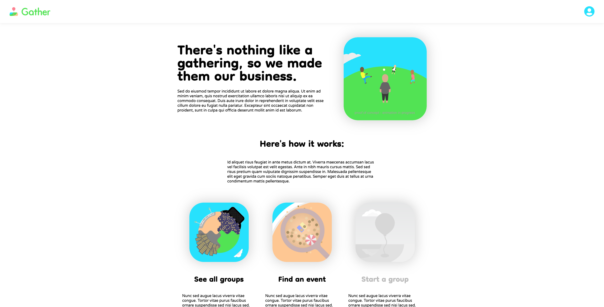

# Gather

Gather is a web app inspired by the popular [Meetup](https://www.meetup.com) site. Gather enables you to join and create groups or events in any city.

[Click here for live view of site.](https://gather.city)

# Wiki Links
  * [API Documentation](https://github.com/cgrq/Gather/wiki/API-Documentation)
  * [Database Schema](https://github.com/cgrq/Gather/wiki/Database-Schema)
  * [Feature List](https://github.com/cgrq/Gather/wiki/Feature-List)
  * [Redux Store Shape](https://github.com/cgrq/Gather/wiki/Redux-Store-Shape)

# Tech Stack

Frameworks and Libraries:

      

Database:


Hosting:

 


# Homepage



# Running project locally

## Step 1 (Run backend)

* Index into backend folder

    ``` cd /backend```

* Install dependencies:

  ``` npm install ```

* Create .env file by following the ```.env.example``` file given.

* Build database using the following commands:

  ```
  npx dotenv sequelize db:create
  npx dotenv sequelize db:migrate
  npx dotenv sequelize db:seed:all
  ```

* And run the following command:

  ``` npm start ```
## Step 2 (Run frontend)

* Index into frontend folder

  ``` cd /frontend```

* Install dependencies:

  ``` npm install ```

* And run the following command to be able to visit the site at https://localhost:3000:

  ``` npm start ```


# Roadmap

  * Groups (Complete)
  * Events (Complete)
  * Search (coming soon)
  * Events Calendar (coming soon)
  * AWS/S3 Image Upload (coming soon)
  * Google Maps Integration (coming soon)

# Contact

Feel free to message me on [LinkedIn](https://www.linkedin.com/in/c--r/)!
